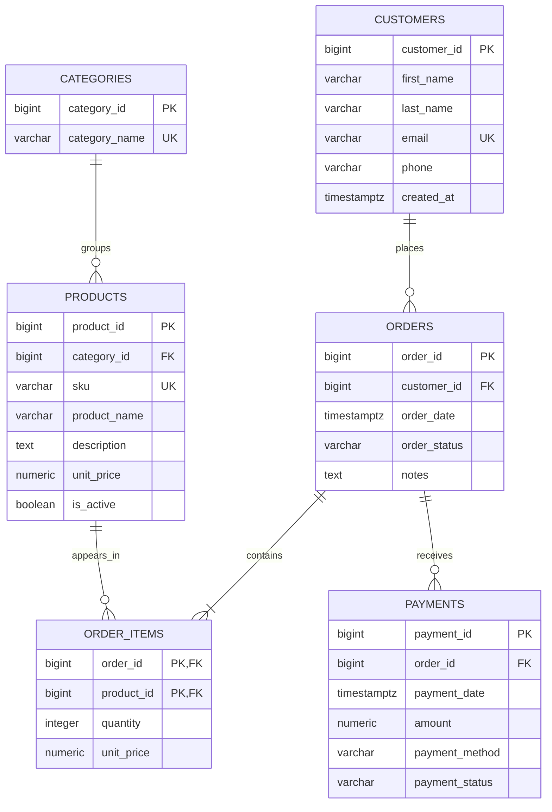

# Entity Relationship Diagram

```mermaid
erDiagram
    CUSTOMERS ||--o{ ORDERS : places
    CATEGORIES ||--o{ PRODUCTS : groups
    ORDERS ||--|{ ORDER_ITEMS : contains
    PRODUCTS ||--o{ ORDER_ITEMS : appears_in
    ORDERS ||--o{ PAYMENTS : receives

    CUSTOMERS {
        bigint customer_id PK
        varchar first_name
        varchar last_name
        varchar email UK
        varchar phone
        timestamptz created_at
    }

    CATEGORIES {
        bigint category_id PK
        varchar category_name UK
    }

    PRODUCTS {
        bigint product_id PK
        bigint category_id FK
        varchar sku UK
        varchar product_name
        text description
        numeric unit_price
        boolean is_active
    }

    ORDERS {
        bigint order_id PK
        bigint customer_id FK
        timestamptz order_date
        varchar order_status
        text notes
    }

    ORDER_ITEMS {
        bigint order_id PK, FK
        bigint product_id PK, FK
        integer quantity
        numeric unit_price
    }

    PAYMENTS {
        bigint payment_id PK
        bigint order_id FK
        timestamptz payment_date
        numeric amount
        varchar payment_method
        varchar payment_status
    }
```
